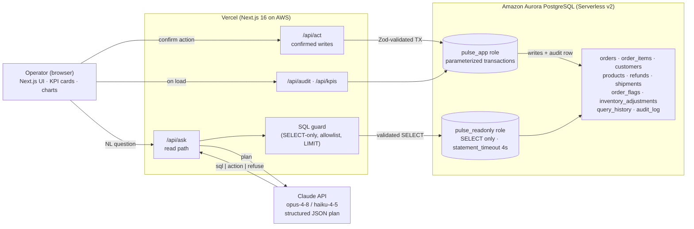

# Pulse — Architecture Diagram (submission artifact)

H0 requires an architecture diagram showing app → backend connections. Two ways
to produce the image:

- **Fastest:** copy the Mermaid block below into <https://mermaid.live>, then
  export PNG/SVG. (VS Code "Markdown Preview Mermaid Support" also renders it.)
- **Polished:** rebuild it in <https://draw.io> using AWS icons (Aurora, etc.).

---

## Mermaid (paste into mermaid.live)



---

## ASCII fallback

```
 ┌──────────────┐  NL question   ┌──────────────────────────┐
 │  Operator    │ ─────────────▶ │  Next.js UI (Vercel)      │
 │  (browser)   │ ◀── charts ─── │  KPI cards · ask · audit  │
 └──────────────┘                └───┬───────────┬──────────┘
                       /api/ask        │           │ /api/act (after confirm)
                                       ▼           ▼
                          ┌─────────────────────────────────┐
                          │ Vercel Functions                 │
                          │  planner ─────▶ Claude API        │
                          │  SQL guard (SELECT-only/allowlist)│
                          │  action executor (Zod + TX)       │
                          └──────┬───────────────┬───────────┘
              read-only SELECT   │               │ parameterized TX
                                 ▼               ▼
                   ┌───────────────────────────────────────────┐
                   │  Amazon Aurora PostgreSQL                  │
                   │  roles: pulse_readonly | pulse_app         │
                   │  10 tables incl. query_history, audit_log  │
                   └───────────────────────────────────────────┘
```

**Talking points for the demo:** two DB roles (least privilege), reads and
writes are separate code paths, every write is human-confirmed and audited.
